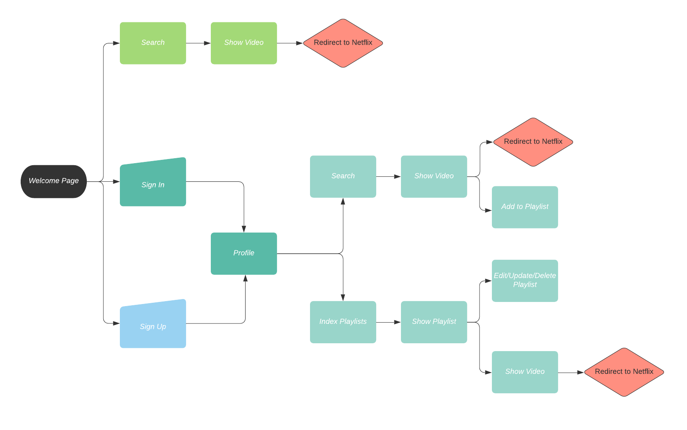
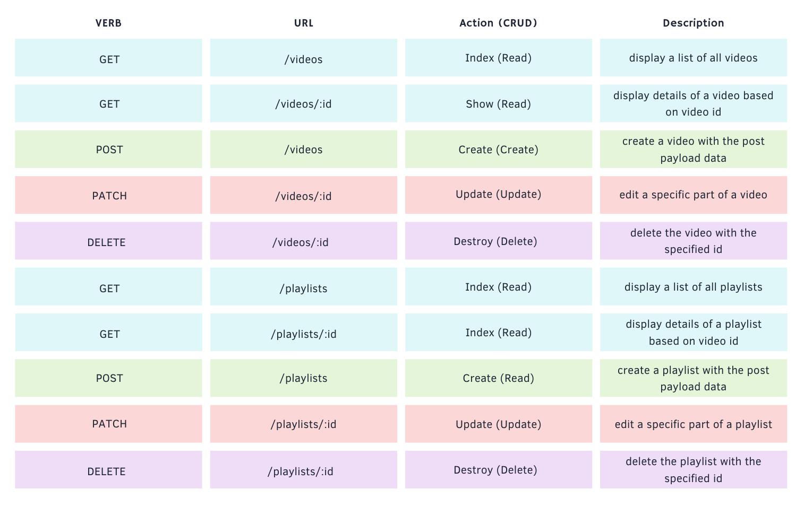

# Netflixify-Client

With Netflixify, a user can search all the the current movies and shows on their country's Netflix. User's will have the ability to create their own playlists and add as many shows/movies to it. Organize your watchlists with ease!

## Deployed App
[Netflixify App](https://netflixify.herokuapp.com/)

## User Story
* AAU, I want to view all shows/movies based on country
* AAU, I want to view a single show/movie
* AAU, I want to create a playlist
* AAU, I want to assign multiple shows/movies to a playlist
* AAU, I want to view all playlists
* AAU, I want to view a single playlist
* AAU, I want to edit a playlist's title and shows/movies
* AAU, I want to delete a playlist

## Userflow


## Install
1. Fork and clone repo, then run `npm i`
2. Open code
3. Go to [unogsNG](https://rapidapi.com/unogs/api/unogsng) and [uNoGS](https://rapidapi.com/unogs/api/uNoGS) to sign up for a free account to subscribe for a free API key
2. Download code to your terminal and run `npm i`
3. Open code 
4. Copy API keys and paste in `.env` file
```js
REACT_APP_RAPID_API_KEY="<uNoGS API key>"
REACT_APP_UNOGSNG_KEY="<unogsNG API key>"
```
7. run `npm start` in terminal
8. Fork and clone [Server Repository](https://github.com/paulinal3/netflixify-api), then run `npm i`
9. Go to [MongoDB Atlas](https://www.mongodb.com/atlas/database) and sign up for free account
10. Create a user in `Database Access` and add IP address that is allowed from anywhere in `Network Access`
11. Create a cluster, connect your application, and copy your connection string and paste in `.env` file
``` js
MONGODB_URI=mongodb+srv://<username>:<password>@netflixify.tjno5.mongodb.net/<dbName>?retryWrites=true&w=majority
```
12. run `nodemon` in terminal

## Tech Stack
* Mongo
* Express
* React
* CSS/Bootstrap

## Server Repository
[Netflixify API Repository](https://github.com/paulinal3/netflixify-api)

## ERD


## RESTful Routes


## API
* uNoGS
* unogsNG

## Endpoint Examples

Root API = `https://unogs-unogs-v1.p.rapidapi.com/aaapi.cgi`

INDEX movies and shows in US--> `?q=&cl=78&p=1&t=ns&st=adv`
```js
{
    "COUNT": "5883",
    "ITEMS": [
        {
            "netflixid": "81274959",
            "title": "The Wasteland",
            "image": "https://occ-0-363-2567.1.nflxso.net/dnm/api/v6/evlCitJPPCVCry0BZlEFb5-QjKc/AAAABWb3Xa5sQ7F_TbMRp4mRzDDJT49MHxmwzYiURJq-swBoU9KWTcDEegfatfm1RaN9Z_WE4A65fGZea_l48iKjT2nqDF-Ftu3cFTRBudb_THFjd7sbgWregHZHSe4.jpg?r=700",
            "synopsis": "A 19th-century family living in seclusion is visited by an evil being that feeds on fear. Can little Diego save his mother from the beast &mdash; and herself?",
            "rating": "6.4",
            "type": "movie",
            "released": "2022",
            "runtime": "1h33m",
            "largeimage": "https://occ-0-1986-2567.1.nflxso.net/dnm/api/v6/evlCitJPPCVCry0BZlEFb5-QjKc/AAAABXw0NmHW0mVewDIyhzSLldU62gdkWG1ADtCLHBmzyI_LZF_EcNgyDPm_rG6m20ztXKy9u-1b3yW9Oizazzx-7WHu4VAU4hsWgeI2pj9Du4alNboqjJYHJYGyL7Xc1Q.jpg?r=700",
            "unogsdate": "2022-01-06",
            "imdbid": "tt12792588",
            "download": "0"
        }
```

SHOW a movie or show --> `?t=loadvideo&q=<netflixid>`

REDIRECT to Netflix --> `https://www.netflix.com/title/<netflixid>`

## MVP
* Welcome/home page that renders sign up/in
* User profile that displays user's playlists
* User will be able to search for movies/shows by:
    * genre
    * type
    * date?
* User will be able to save a movie/show to a playlist
* User will be able to view, edit and delete a playlist
* User will be redirected to corresponding Netflix page if they want to watch the show/movie

## Stretch Goals
* Allow users to mark what shows/movies they have watched
* Allow user to leave notes about shows/movies
* Allow for international users to be able to search based on their country's Netflix