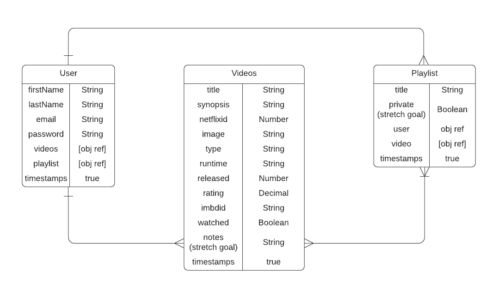

# Netflixify-Client

With Netflixify, a user can search all the the current movies and shows on their country's Netflix. User's will have the ability to create their own playlists and add as many shows/movies to it. Organize your watchlists with ease!

## User Story
* AAU, I want to view all shows/movies based on country
* AAU, I want to view a single show/movie
* AAU, I want to create a playlist
* AAU, I want to assign multiple shows/movies to a playlist
* AAU, I want to view all playlists
* AAU, I want to view a single playlist
* AAU, I want to edit a playlist's title and shows/movies
* AAU, I want to delete a playlist

## Deployed App

## Install
1. Go to https://rapidapi.com/unogs/api/unogsng and https://rapidapi.com/unogs/api/uNoGS to sign up for a free account to subscribe for a free API key
2. Download code to your terminal and run `npm i`
3. Open code 
4. Copy API key from and paste in `.env` file
## Tech Stack
* Mongo
* Express
* React
* CSS/Bootstrap

## Wireframes


## ERD


## RESTful Routes


## API
* uNoGS

## Endpoint Examples

Root API = `https://unogs-unogs-v1.p.rapidapi.com/aaapi.cgi`

INDEX movies and shows in US--> `?q=&cl=78&p=1&t=ns&st=adv`
```js
{
    "COUNT": "5883",
    "ITEMS": [
        {
            "netflixid": "81274959",
            "title": "The Wasteland",
            "image": "https://occ-0-363-2567.1.nflxso.net/dnm/api/v6/evlCitJPPCVCry0BZlEFb5-QjKc/AAAABWb3Xa5sQ7F_TbMRp4mRzDDJT49MHxmwzYiURJq-swBoU9KWTcDEegfatfm1RaN9Z_WE4A65fGZea_l48iKjT2nqDF-Ftu3cFTRBudb_THFjd7sbgWregHZHSe4.jpg?r=700",
            "synopsis": "A 19th-century family living in seclusion is visited by an evil being that feeds on fear. Can little Diego save his mother from the beast &mdash; and herself?",
            "rating": "6.4",
            "type": "movie",
            "released": "2022",
            "runtime": "1h33m",
            "largeimage": "https://occ-0-1986-2567.1.nflxso.net/dnm/api/v6/evlCitJPPCVCry0BZlEFb5-QjKc/AAAABXw0NmHW0mVewDIyhzSLldU62gdkWG1ADtCLHBmzyI_LZF_EcNgyDPm_rG6m20ztXKy9u-1b3yW9Oizazzx-7WHu4VAU4hsWgeI2pj9Du4alNboqjJYHJYGyL7Xc1Q.jpg?r=700",
            "unogsdate": "2022-01-06",
            "imdbid": "tt12792588",
            "download": "0"
        }
```

SHOW a movie or show --> `?t=loadvideo&q=<netflixid>`

REDIRECT to Netflix -->    `https://www.netflix.com/title/<netflixid>`

## MVP
* Welcome/home page that renders sign up/in
* User profile that displays user's playlists
* User will be able to search for movies/shows by:
    * genre
    * type
    * date?
* User will be able to save a movie/show to a playlist
* User will be able to view, edit and delete a playlist
* User will be redirected to corresponding Netflix page if they want to watch the show/movie

## Stretch Goals
* Allow users to mark what shows/movies they have watched
* Allow user to leave notes about shows/movies
* Allow for international users to be able to search based on their country's Netflix

## Potential Roadblocks
* Using an unofficial api

# Getting Started with Create React App

This project was bootstrapped with [Create React App](https://github.com/facebook/create-react-app).

## Available Scripts

In the project directory, you can run:

### `npm start`

Runs the app in the development mode.\
Open [http://localhost:3000](http://localhost:3000) to view it in the browser.

The page will reload if you make edits.\
You will also see any lint errors in the console.


## Learn More

You can learn more in the [Create React App documentation](https://facebook.github.io/create-react-app/docs/getting-started).

To learn React, check out the [React documentation](https://reactjs.org/).

### Code Splitting

This section has moved here: [https://facebook.github.io/create-react-app/docs/code-splitting](https://facebook.github.io/create-react-app/docs/code-splitting)

### Analyzing the Bundle Size

This section has moved here: [https://facebook.github.io/create-react-app/docs/analyzing-the-bundle-size](https://facebook.github.io/create-react-app/docs/analyzing-the-bundle-size)

### Making a Progressive Web App

This section has moved here: [https://facebook.github.io/create-react-app/docs/making-a-progressive-web-app](https://facebook.github.io/create-react-app/docs/making-a-progressive-web-app)

### Advanced Configuration

This section has moved here: [https://facebook.github.io/create-react-app/docs/advanced-configuration](https://facebook.github.io/create-react-app/docs/advanced-configuration)
